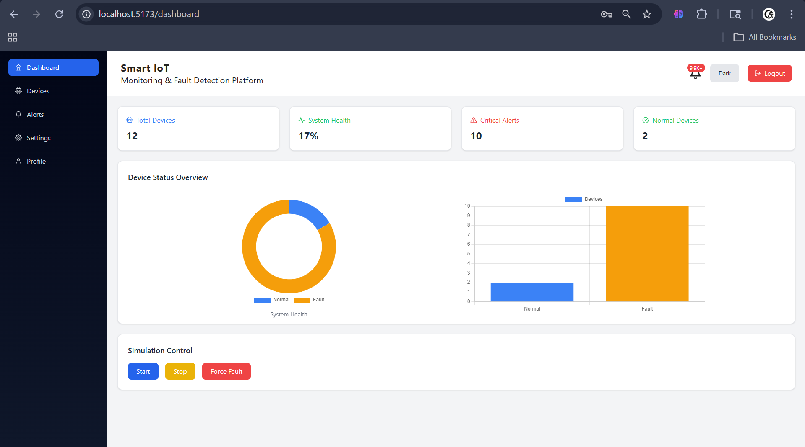
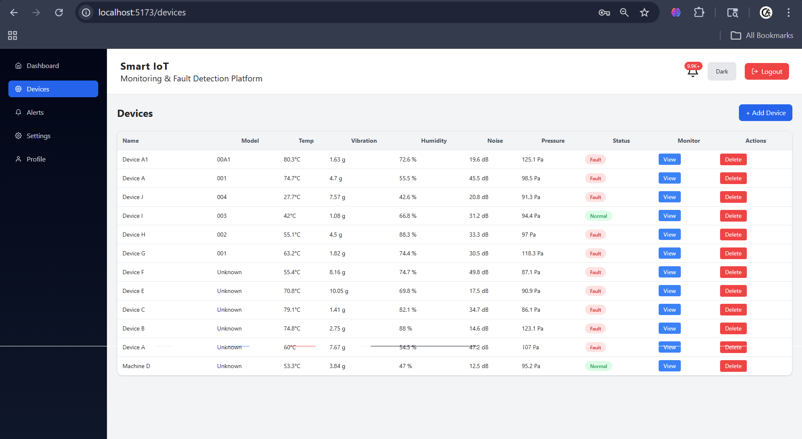
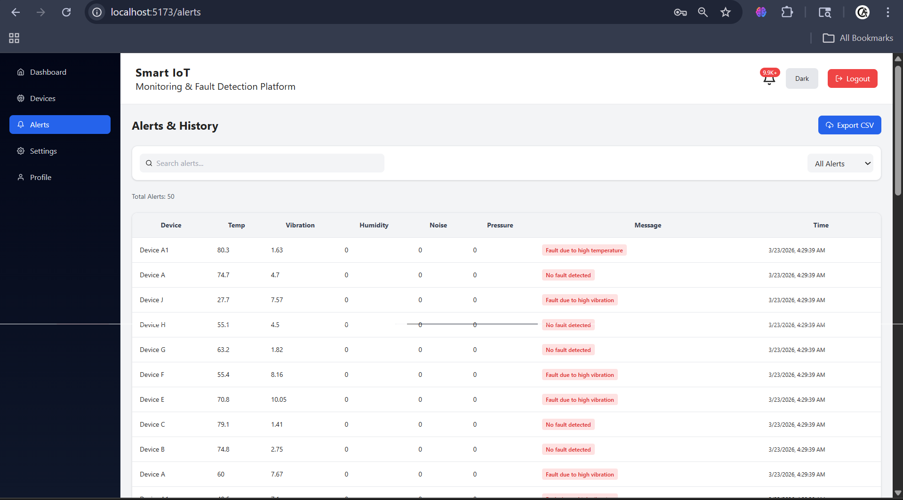
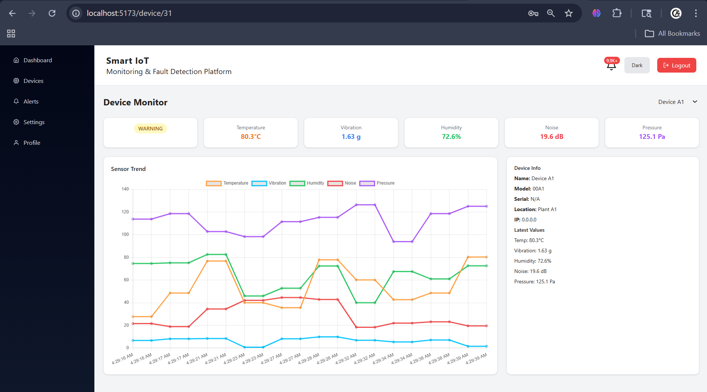
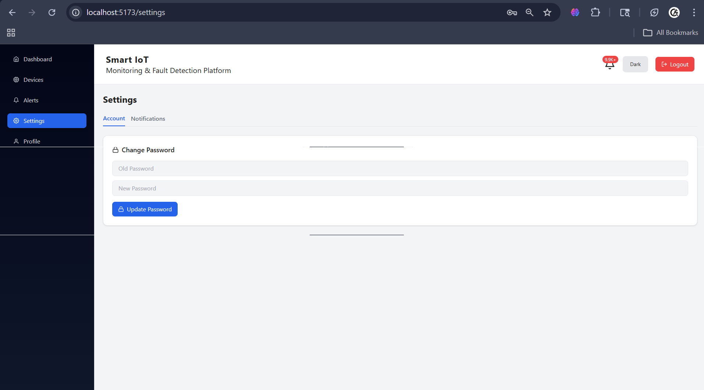
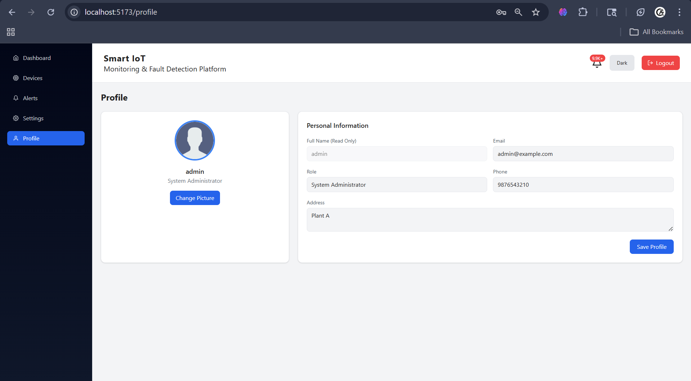

# 🚀 Smart IoT Monitoring and Fault Detection Platform

A full-stack web application that monitors IoT devices in real-time, detects faults automatically, and provides a centralized dashboard for alerts, analytics, and device management.

---

## 📌 Features

* 🔐 User Authentication (Login & Token-based access)
* 📊 Real-time Dashboard Monitoring
* 🖥️ Device Management (Add / Edit / Delete)
* 🚨 Automatic Fault Detection & Alerts
* 🔔 Notification System with Alert Count
* ⚙️ User Settings (Notifications, Preferences)
* 👤 Profile Management
* 🌙 Light & Dark Mode UI

---

## 🧠 System Overview

This platform simulates IoT devices and continuously monitors parameters such as temperature, vibration, and other sensor values. When abnormal values are detected, the system generates alerts and updates the dashboard in real-time.

---

## 🛠️ Tech Stack

### 🔹 Frontend

* React (Vite)
* Tailwind CSS
* Chart.js
* Axios

### 🔹 Backend

* Django
* Django REST Framework
* Token Authentication

### 🔹 Database

* SQLite (Development)

---

## 📸 Screenshots

> Add your screenshots here

### 🔹 Dashboard


### 🔹 Devices


### 🔹 Alerts


### 🔹 Device Monitor


### 🔹 Settings


### 🔹 Profile


---

## ⚙️ Installation & Setup

### 🔹 Clone the repository

```bash
git clone https://github.com/Anandhitha20/smart-iot-monitoring-platform.git
cd smart-iot-platform
```

---

### 🔹 Backend Setup (Django)

```bash
cd backend
python -m venv venv
venv\Scripts\activate   # Windows
pip install -r requirements.txt
python manage.py migrate
python manage.py runserver
```

---

### 🔹 Frontend Setup (React)

```bash
cd frontend
npm install
npm run dev
```

---

## 🔄 How It Works

1. Start simulation from dashboard
2. Sensor values update automatically
3. Fault conditions trigger alerts
4. Alerts are stored and displayed
5. Notification bell updates dynamically

---

## 🎯 Future Enhancements

* Real-time updates using WebSockets
* Deployment (AWS / Render / Vercel)
* Advanced analytics & reports
* Mobile responsiveness improvements

---
